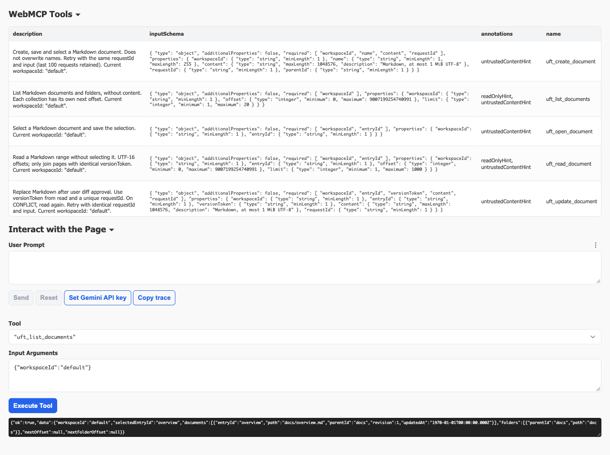
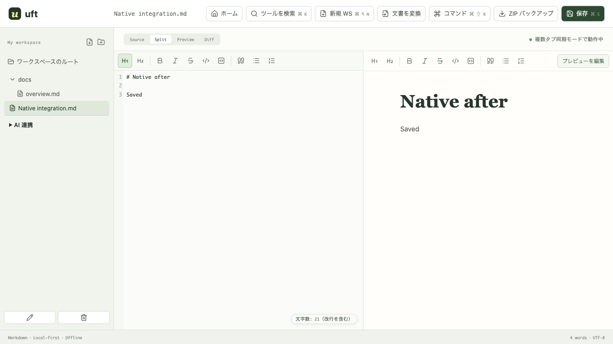

# WebMCP 実装・検証記録

検証日: 2026-10-02（日本時間）。[導入計画](../_plans/webmcp-markdown-editor.md) の 5 ツールを実装し、修正と検証を繰り返した。公開 origin の Origin Trial 試験は未実施のため、計画全体の完了とは扱わない。

## 実装と利用方法

`/workspace` のサイドバーの「AI 連携」を開き、「AI 連携を有効にする」を選択する。既定は無効。本文が対応 AI サービスで処理される可能性と、別タブの未保存入力を保護できないことを同じ場所に表示する。設定はページセッション内だけ有効で、別ワークスペースでは再度有効化する。

公開する操作は一覧、分割読み取り、文書切り替え、Markdown 作成、本文置換の 5 つ。ページ、初期化完了、設定、workspace ID に基づいて登録する。入力は JSON Schema と実行時の両方で検証する。名前・本文をツール説明へ埋め込まない。作成は同名を上書きしない。更新には versionToken と requestId が必要で、UFT の差分確認で承認するまで書き込まない。

手動・遅延・ツールの保存は同じページ内のキューを使う。保存 transaction の中でも最新の同じタブの版を再確認し、ハッシュ計算中に発生した対象文書の変更を拒否する。対象以外の直前の編集は、最新のローカル状態から同じ transaction へ統合する。通常保存の merge、条件付き更新、成功した requestId の記録は IndexedDB の同一 readwrite transaction で行い、oncomplete 後にだけ保存成功を返す。同期や版取得に選択メタデータの副作用を持つ open() を使わない。ワークスペース切り替えも保存キューに接続した。

版 token は workspace/document ID、ローカル版、保存版に結び付ける。revision、時刻、本文、deletedAt などを SHA-256 の入力に含め、比較は transaction 内で保存版の本文・revision・時刻・削除状態を直接確認する。同じ revision/時刻の別本文を拒否する。対象以外の手動編集・別タブの保存を保持する。ツール更新は CodeMirror の履歴を区切り、1 回の Undo/Redo で戻せる。

保存形式のバージョン変更、外部通信先の追加、CSP の緩和、モデル API 呼び出し、navigator API へのフォールバック、ポリフィルは追加していない。IndexedDB が現在の保存先で、旧 OPFS SQLite の取り込み経路を維持する。専用試験で旧 SQLite ファイルとアセットを実際に作成し、IndexedDB への取り込みと再読み込みを確認した。

## 確認環境とコマンド

| 対象 | 結果 |
| --- | --- |
| `pnpm check` | 0 errors / 0 warnings |
| `pnpm lint` | 成功 |
| `pnpm test` | 19 ファイル、79 テスト成功 |
| `pnpm build` | 成功。500 kB 超の既存依存チャンクに対する Vite のサイズ警告あり |
| `pnpm test:e2e` | 最新の全回帰の単独実行で 69 成功。ネイティブ API 2 件と公開 trial 1 件を通常実行では skip |
| CI と同じ WebMCP 対象・オプションの実行 | UI モック・実 IndexedDB・旧 OPFS 取り込みの 25 件がローカルで成功 |
| 追加の登録失敗レース試験 | 最後のツールの登録が失敗した際、登録途中で呼ばれた作成が中止され、文書を保存しないことを 1 件確認（全 E2E に含む） |
| 追加の旧 OPFS 実データ試験 | 実 SQLite ファイルとアセットを IndexedDB へ取り込み、再読み込みまで 1 件成功（全 E2E に含む） |
| トークン付き本番ビルド、Chrome 153、headed、フラグなし | 無効 token 2 件が `Malformed` と判定され、通常編集・保存・再読み込みが成功。公開検証用テスト 1 件成功（ローカル URL） |
| Chrome for Testing 153.0.8010.12、headed、実験機能有効 | 実 API 専用 2 件成功 |
| Chrome for Testing 151.0.7922.34、headed、実験機能有効 | 5 ツール、保存、Undo/Redo、登録解除を確認。signal 専用試験 1 件 skip |
| Model Context Tool Inspector 1.9.18 | 実 API による 5 ツールの名前・スキーマ・注釈を検出。引数を指定した一覧の実行と JSON 結果表示が成功 |
| 本番 `dist` + `public/_headers` の CSP/COOP/COEP | フラグ有効時の作成・保存・再読み込み成功。フラグ無効 + 無効 Origin Trial token でも通常編集・保存・再読み込み成功。pageerror 0、外部 origin へのリクエスト 0。[実測 JSON](webmcp-production.json) |

ネイティブ試験を通常 CI の API モック試験と混同しない。実 API 専用試験は次で実行する。

```bash
WEBMCP_NATIVE=1 pnpm exec playwright test e2e/webmcp-native.spec.ts --workers=1

# 特定の Chrome を使う場合（インストール済み実行ファイルのパスを指定）
WEBMCP_NATIVE=1 WEBMCP_NATIVE_EXECUTABLE_PATH=/path/to/chrome \
  pnpm exec playwright test e2e/webmcp-native.spec.ts --workers=1
```

回帰試験と実機専用試験を同時実行した際、一度 4 件（変換後の遷移、検索のフォーカス、名前入力モーダル、選択範囲）が失敗した。アプリ・試験内容を変更せず、失敗した 4 件の単独実行と、その後の全回帰の単独実行（69 件）が成功した。原因は確定していないため、検証時は実機専用試験と全回帰を分けて実行する。

専用試験は headed で起動し、ローカル試験用の `--enable-experimental-web-platform-features` を渡す。本番でこのフラグを要求する実装ではない。利用者向けの公式ローカル試験手順は `chrome://flags/#enable-webmcp-testing`。公開サイトでフラグなしの API 提供を行う場合は公開 origin の試験登録が別途必要。

151 の実行 callback は第二引数なし、153 は `{ signal: AbortSignal }` を渡した。UFT は第二引数なしでもアプリのキャンセルと登録寿命を扱う。エージェントのキャンセルが callback に伝わる保証を 151 では確認していない。153 の executeTool に signal を渡して AbortError と差分確認の終了、本文が変わらないことを確認した。151/153 の executeTool 引数・返り値は JSON 文字列。callback 自体は JSON 化可能なオブジェクトを返す。155 以降のオブジェクト引数は公式資料に合わせて試験コードに分岐を設けたが、155 実機の確認は未実施。

## 受け入れ条件との対応

| 計画の条件 | 証拠・現在の状態 |
| --- | --- |
| 有効な `/workspace` に 5 ツールだけを登録、無効化・離脱・workspace 変更で解除 | `webmcp.spec.ts` の opt-in/他ページ/workspace 試験、ネイティブ試験、登録一部失敗・遅い完了の単体試験と、登録途中に呼ばれた作成の中止 E2E。キー入力中に登録回数が増えないことも確認 |
| API なし・無効 trial・登録失敗でも通常編集/保存 | 未対応・登録失敗 E2E、本番ビルドの無効 token 試験。真正な期限切れ token は未検証 |
| 範囲制限と長文の分割読み取り | 型、余分な項目、UTF-8 1 MiB、255 UTF-16 名前、offset/limit の単体試験。サロゲートペアと複数ページの再構成、範囲外、1 MiB 超の既存文書の読み取りと更新拒否を E2E で確認 |
| 成功後の再読み込み、失敗・拒否時に本文を確定しない | 5 操作 E2E とネイティブ試験。書き込み失敗、拒否、signal キャンセル、無効化の E2E。transaction abort で本文と request 記録の双方が残らないことを実 IndexedDB で確認 |
| 古い AI 編集の拒否、別文書の変更保持 | 確認中の手動編集、保存版が同 revision/時刻で本文だけ異なる場合、確認中の他タブ保存、別文書の保存保持、未選択文書更新の E2E |
| 差分確認、エディタ/プレビュー/文字数/保存表示、Undo/Redo | UI の 5 操作 E2E と headed ネイティブ試験。手動 Undo の更新時刻が前版より新しくなる単体試験 |
| 重複排除、キャンセル後の状態 | reload 後の同 request ID、入力順だけ異なる再試行、異なる入力の拒否、2 タブの同時作成/更新、直近 100 件の保持。書き込み中 abort と commit 後 abort の試験 |
| データ提供と未保存入力の限界の説明 | AI 連携の設定 UI、README、調査資料に記載 |
| 必須チェック、回帰、Inspector/実ブラウザ記録 | 上表のチェック結果、以下のスクリーンショット。公開 origin の trial と Inspector のモデルによる自然言語試験は残る |

主な自動試験は [旧 OPFS 取り込み](../../e2e/webmcp-legacy.spec.ts)、[WebMCP UI](../../e2e/webmcp.spec.ts)、[実 IndexedDB](../../e2e/webmcp-storage.spec.ts)、[ネイティブ API](../../e2e/webmcp-native.spec.ts)、[入力・版・ページング](../../src/lib/webmcp/markdown-tools.test.ts)、[登録寿命](../../src/lib/webmcp/register-tools.test.ts)。既存の選択範囲、手動/プレビュー編集、複数タブ同期、Markdown/ZIP 出力、ZIP 復元、図表 SVG、変換、ランチャー、IP ツール、モバイルの回帰も成功した。

Inspector は配布版の拡張を一時プロファイルに読み込み、Gemini API キーを設定せず手動実行を確認した。既存のブラウザプロファイルへ拡張をインストールしていない。





## 修正した問題

- 登録の部分失敗時に、既に呼ばれたツールの実行寿命も中止するよう修正。
- 151 が signal を渡さず、最初の全ツール呼び出しが失敗する問題を修正。
- 保存の読み取りと書き込みを分離していた経路を同一 transaction の merge に変更。
- 保存中 abort で transaction inactive が出た場合も CANCELLED を返し、commit 後のキャンセルを巻き戻しと報告しないよう修正。
- request 入力のキー順が違うだけの再試行を同一扱いにし、別タブで成功済みの更新を確認後に再試行しても再適用しないよう修正。
- 外部更新の Undo を独立させ、未来時刻や同じミリ秒の前版より手動更新が必ず新しくなるよう修正。
- 別タブが作成先フォルダを直前に改名しても、保存時の最新パスを使うよう修正。
- 差分確認が既存の名前入力モーダルを覆う UI の重なりを修正。
- 通常の保存表示と説明文が回帰試験で混同される表現を修正。
- ワークスペース切り替えがツール保存へ割り込む余地を減らすため、選択メタデータの更新を保存キューへ接続。
- ハッシュ計算後のローカル本文を transaction 内でも再検証し、別文書のその間の編集を最新状態から保存。
- 既に開いていた作成・名前変更ダイアログの送信でも保存ガードを確認。

## CI の統合

導入計画にあった CI の UI・IndexedDB 試験を、[既存の品質チェック](../../.github/workflows/quality.yml) の test job に接続した。単体試験後に Chromium と Linux の必要ライブラリをインストールし、WebMCP UI モック、実 IndexedDB、旧 OPFS 取り込みの 25 件を 2 workers で実行する。失敗時はブラウザの trace を 7 日保持する。モデル API キーや Origin Trial token を必要とする試験はこの job では実行しない。

WebMCP の入力・Undo/Redo のショートカットは `ControlOrMeta` に変更した。[Playwright の定義](https://playwright.dev/docs/api/class-keyboard#keyboard-press)に従い、macOS は Meta、Linux/Windows は Control を使う。同じ試験コマンドのローカル実行と workflow YAML の構文を確認した。GitHub Actions の実行結果と Linux 実機の結果はまだないため、ローカルの成功を CI の成功とは表現しない。構成は [公式 CI 手順](https://playwright.dev/docs/ci-intro) を参照した。

## Origin Trial の設定と公開検証用テスト

[公式の登録手順](https://developer.chrome.com/docs/web-platform/origin-trials) に合わせ、ビルド環境の `WEBMCP_ORIGIN_TRIAL_TOKENS` に発行済み token を指定すると、アプリの script より前に `<meta http-equiv="origin-trial">` を挿入する。カンマまたは空白で複数 origin の token を渡せる。重複を除き、未設定のビルドにはタグを追加しない。署名・origin・有効期限の判断は Chrome に任せる。token を発行する機能ではない。

```bash
WEBMCP_ORIGIN_TRIAL_TOKENS="PUBLIC_TOKEN,PREVIEW_TOKEN" pnpm build

# 公開された有効 trial。対応 Chrome の実行ファイルも指定可能。
WEBMCP_TRIAL_URL="https://YOUR_ORIGIN/workspace" WEBMCP_TRIAL_EXPECTED=enabled \
  pnpm exec playwright test e2e/webmcp-trial.spec.ts --workers=1

# 無効/未設定は disabled、真正な期限切れ token の検証は expired を指定。
```

公開検証用テストは実験機能フラグを渡さない。`enabled` は API の存在だけでなく DevTools Protocol の WebMCP trial が `Enabled` であることを要求する。`expired` は WebMCP token の状態が `Expired` であることを要求し、不正文字列を期限切れの証拠として扱わない。API が利用できない場合の通常編集・保存・再読み込みも検証する。結果は `origin-trial.json` として出力する。対象 URL 未設定の通常 CI ではこの 1 件を skip する。

トークン付き実ビルドでは、無効 token 2 件の重複除去と script より前の挿入、未設定ビルドではタグなしを確認した。Chrome 153 をフラグなしで起動した実測は [無効 trial の診断](webmcp-invalid-trial.json)。2 件とも Chrome が `Malformed` と判定し、API がなくても通常編集と保存が成功した。これは公開 origin の有効・期限切れ試験の代替ではない。

## 残る公開検証

対象公開 URL とその origin 用の有効な Origin Trial token が必要。リポジトリに token はなく、本作業では公開設定の変更・デプロイを行っていない。有効 token と真正な期限切れ token による公開サイトの動作は未検証。無効文字列で API が無効になることを、有効 trial の検証と同一視しない。

Inspector の Gemini 自然言語試験も API キー未設定のため未実施。UFT に AI チャットやキー入力機能は追加しない。試験には専用のサンプル文書を使い、モデルによるツール選択と、引数を指定した手動試験を区別して記録する。

別タブの未保存入力は検出せず、後の手動保存は既存の timestamp merge を使う。CRDT の保証はない。保持範囲外の requestId の二重実行を防ぐ保証もない。

一次資料: [Chrome Imperative API](https://developer.chrome.com/docs/ai/webmcp/imperative-api)、[仕様ドラフト](https://webmachinelearning.github.io/webmcp/)、[Chrome の試験手順](https://developer.chrome.com/docs/ai/webmcp)、[Inspector 配布ページ](https://chromewebstore.google.com/detail/webmcp-model-context-tool/gbpdfapgefenggkahomfgkhfehlcenpd)。API の公開状況は将来変わり得る。


## 継続作業の状態

2026-10-02 の継続確認でも、公開対象 URL、発行済み Origin Trial token、Gemini の検証用キー設定は提供されていない。3 回の連続する goal turn で同じ条件が残った。ローカル実装、試験公開のビルド設定、公開検証用テスト、CI 統合は用意したが、実サイトの有効・期限切れ trial とモデルによる自然言語操作は実行できないため、ゴールは設定待ちの blocked とする。完了とは扱わない。設定が提供された後に残る実検証を再開する。
